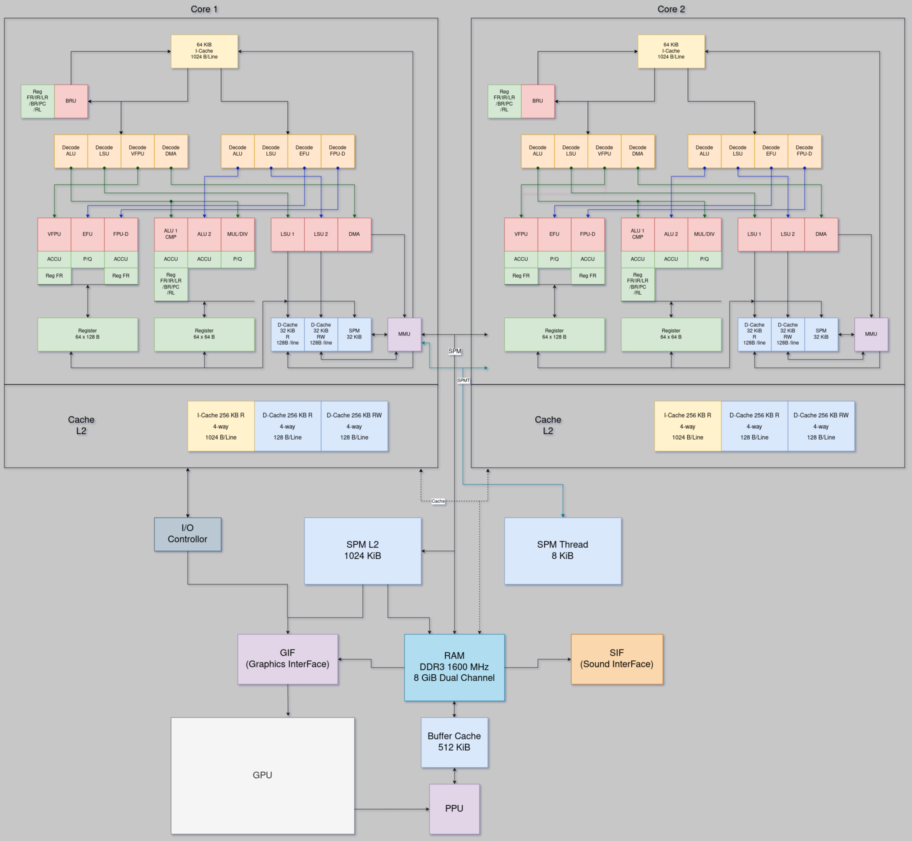

# AltairX
New computer and new CPU PoC

The main processor of the AltairX K1 is a VLIW In Order CPU.  
It has 3 internal memory:  

64 KiB L1 instruction Cache 4-way.  
32 KiB L1 data Cache RW 4-way.  
32 KiB L1 data Cache R 4-way.  
32 KiB L1 data Scratchpad memory.

1 MiB L2 Scratchpad memory.  

The processor has no branch prediction, it will be based on the delay slot (1 cycle for Fetch) and 1 decode cycle + Jump (Delay)

The number of instructions is done via a "Pairing" bit, when it is equal to 1, there is another instruction to be executed in parallel, 0 indicates the end of the bundle.  

   

The goal of this processor is to reach the minimum of latency, and to solve the problem of latency of the RAM.  
For this, the compiler will have to do two things:  
- resolve pipeline conflicts  
- prefetch instruction and data
- use SPM 

To resolve pipeline conflicts, it has an accumulator internal to the ALU and to the VFPU which is register 61.  
To avoid multiple writes to registers due to unsynchronized pipeline, there are two special registers P and Q (Product and Quotient) which are registers 62 and 63, to handle mul / div / sqrt etc etc.  
There is also a specific register for loops (register 60).  

The processor has 64 general registers of 64 bits, and 64 registers of 128 bits for the FPU.  
The processor only has SIMD instructions for the FPU.  

It has 151 instructions distributed like this:  
ALU : 36  
LSU : 28  
CMP : 8  
Other : 2  
BRU : 20  
VFPU : 32  
EFU : 12  
FPU-D : 8  
DMA : 5  

For floating point numbers in AltairX , it will not be 100% compatible with the standard with IEEE 754  
-Non-normalized numbers are not handled (they are equal to zero).  
-Infinite numbers cannot be handled (they are worth the max value).  
-NaN values are not manage (they are worth the max value).  
-Rounding is always towards 0  
-Exceptions are not handled   

For the calculation unit it has:  
2ALU+2LSU 1VFPU 1EFU 1FPU-D 1DIV/MUL BRU/CMP  

The advantage of this processor is that it has a simple design, and requires little transistor for "high performance" and therefore consume / cost less than CISC/RISC Out Of Order processors.

### Todo list
- Translate the IR code (Clang) for AltairX
- Terminate virtual machine (cycle emulation and device management) 

## Target configuration
8 cores : AltairX K1 2.5 GHz  
DD3 1600 MHz , 8GB in a unified memory  
GPU Aldebaran G1 1 GHz , 2 CU , 256 GFlops  

## Link
AltairX K1 ISA : https://docs.google.com/spreadsheets/d/1AmdMslRcXIX9pKGBSRJJcx2IvRyzBLjA61SzxmlEYf8/edit?usp=sharing   

AltairX K1 Pipeline : https://docs.google.com/spreadsheets/d/1u-XBjAyq8LOzAFcWMXsdAChMMzbmTIuZtzWQ7XDTRdk/edit?usp=sharing  

AltairX K1 Memory Map : https://docs.google.com/spreadsheets/d/1UQ15KpRRWncc_Ouzhas0W1uWuSIfjAODw8KD-2-AoDA/edit?usp=sharing  

AltairX IR ISA : https://docs.google.com/spreadsheets/d/19nOBbH_4KWaXxDSNA4JuZjaBble0VRrBxcVlEjTZ3iI/edit?usp=sharing

AltairX Executable Header : https://docs.google.com/spreadsheets/d/1g7mEhaBIVBJ75-5gJ_TrYiVJVTZHEJQnqN0XXUBX57g/edit?usp=sharing

Aldebaran G1 ISA : https://docs.google.com/spreadsheets/d/1LiSZbdd6wCpa-sZZ9uLg5eAyGxdpMl363waUP927xS4/edit?usp=sharing  

GPU todo list : https://docs.google.com/spreadsheets/d/1eRX1vLHEJdrAsx2u1OiycSSz82G3cboVMcu8gBYkgGA/edit?usp=sharing  

## AltairX Pipeline  

## Pipeline

## Architecture

## APU Die (380 MT) 30 mm² , 28 nm FD-SOI

